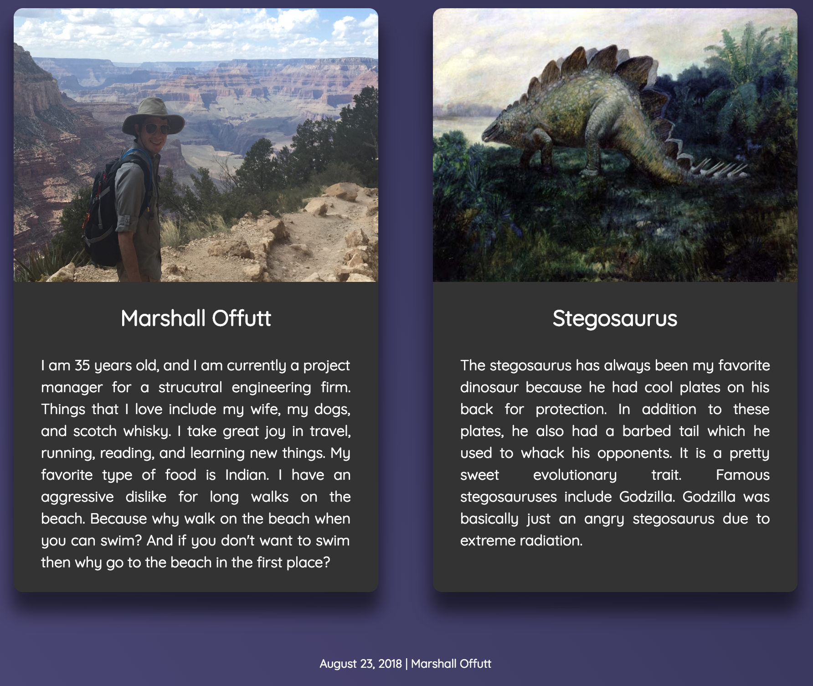

# My Dino

This is a tribute site that pays homage to my favorite dinosaur, and also introduces myself to the coding world.

## Screenshot


## How to run this project
* Use npm to install http-server in your terminal:
```sh
npm install -g http-server
```
* Run the server in your terminal
```sh
hs -p 9999
```
* Open chrome and navigate to:
```
localhost: 9999
```
